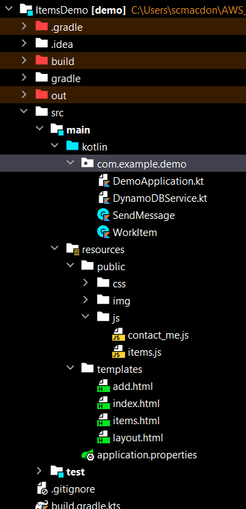
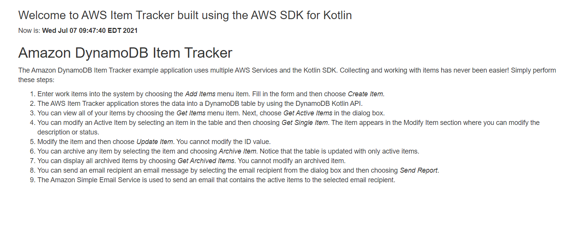
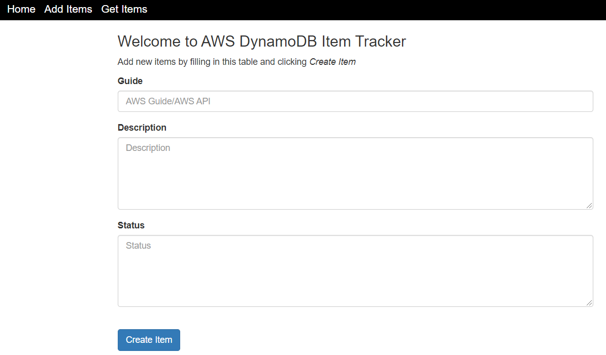
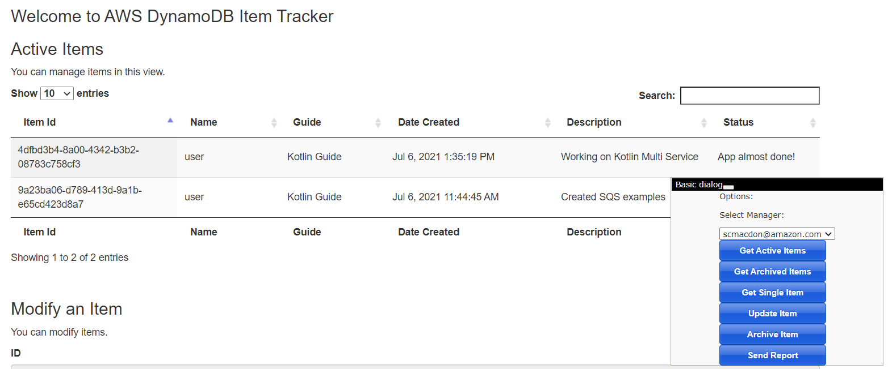
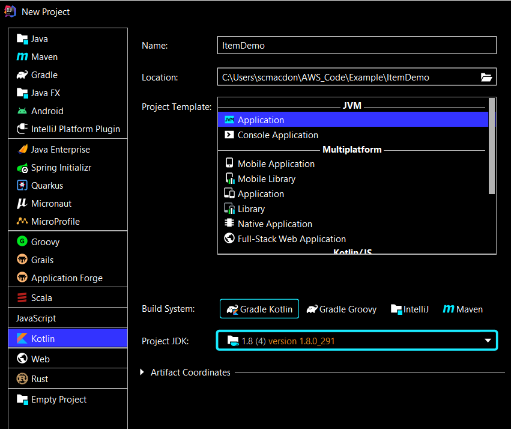
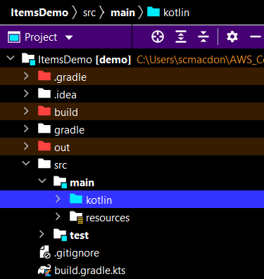
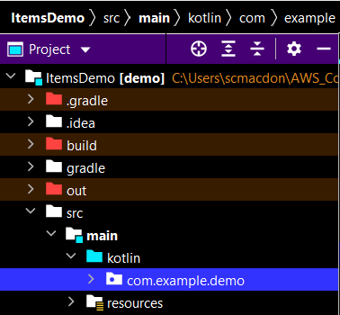
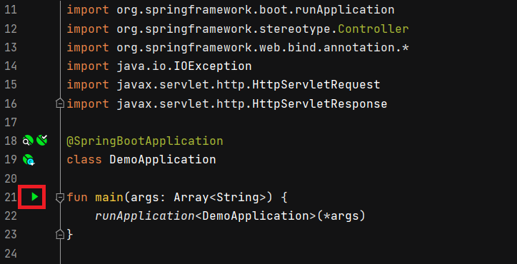

#  Create an Amazon DynamoDB web application by using the AWS SDK for Kotlin

## Purpose

You can develop a dynamic web application that tracks and reports on work items by using the following AWS services:

+ Amazon DynamoDB to store the data
+ Amazon Simple Email Service (Amazon SES) to send email messages

**Note:** In this tutorial, the AWS SDK for Kotlin is used to access Amazon SES and Amazon DynamoDB services.

The application you create is named **DynamoDB Item Tracker**, and uses Spring Boot APIs to build a model, different views, and a controller. For more information, see [Spring Boot](https://www.tutorialspoint.com/spring_boot/index.htm).

This tutorial guides you through creating the **DynamoDB Item Tracker** application. The following figure shows you the structure of the Kotlin project.



**Note:** All of the Kotlin code required to complete this tutorial is located in this GitHub repository (or you can copy the code from this tutorial).  

#### Topics

+ Prerequisites
+ Understand the item tracker application
+ Create an IntelliJ project named ItemsDemo
+ Add the dependencies to your Gradle build file
+ Create the Kotlin code
+ Create the HTML files
+ Create script files
+ Run the application

## Prerequisites

To complete the tutorial, you need the following:

+ An AWS account
+ A Kotlin IDE (this tutorial uses the IntelliJ IDE)
+ Java 1.8 JDK
+ Gradle 6.8 or higher

**Note**: Make sure that you have installed the Kotlin plug-in for IntelliJ. 

### ⚠️ Important

+ The AWS services included in this document are included in the [AWS Free Tier](https://aws.amazon.com/free/?all-free-tier.sort-by=item.additionalFields.SortRank&all-free-tier.sort-order=asc).
+  This code has not been tested in all AWS Regions. Some AWS services are available only in specific regions. For more information, see [AWS Regional Services](https://aws.amazon.com/about-aws/global-infrastructure/regional-product-services). 
+ Running this code might result in charges to your AWS account. 
+ Be sure to terminate all of the resources you create while going through this tutorial to ensure that you’re not charged.

### Creating the resources

Create an Amazon DynamoDB table named **Work** that contains a partition key named **id**. For more information, see [Create a Table](https://docs.aws.amazon.com/amazondynamodb/latest/developerguide/getting-started-step-1.html). 


## Understand the DynamoDB Item Tracker application

The **DynamoDB Item Tracker** application uses a model that is based on a work item and contains these attributes:

+ **date** - The start date of the item.
+ **description** - The description of the item.
+ **guide** - The deliverable that this item has an impact on.
+ **username** - The person who performs the work item.
+ **status** - The status of the item.
+ **archive** - Whether this item is completed or is still being worked on.

The following figure shows the **Home** page.



#### Application functionality
A user can perform these tasks in the **DynamoDB Item Tracker** application:

+ Enter an item
+ View all active items
+ View archived items that are complete
+ Modify active items
+ Send a report to an email recipient

The following figure shows the new item section.



A user can retrieve *active* or *archive* items. For example, a user can choose **Get Active Items** to get a dataset that's retrieved from the DynamoDB **Work** table and displayed in the web application.



The user can select the email recipient from the **Select Manager** list and choose **Send Report**. Items are queried from the **Work** table and then the application uses Amazon SES to email the items to the selected email recipient. The following figure is an example of a report.


#### Work table
The DynamoDB table is named **Work** and contains the following fields:

+ **id** - Represents the key.
+ **date** - Specifies the date the item was created.
+ **description** - A value that describes the item.
+ **guide** - A value that represents the deliverable being worked on.
+ **status** - A value that describes the status.
+ **username** - A value that represents the user who entered the item.
+ **archive** - A value that represents whether this is an active or archive item.

The following figure shows the **Work** table.


## Create an IntelliJ project named ItemDemo

The following figure shows the project options.



Perform these steps. 

1. In the IntelliJ IDE, choose **File**, **New**, **Project**.
2. In the **New Project** dialog box, choose **Kotlin**.
3. Enter the name **ItemDemo**. 
4. Select **Gradle Kotlin** for the Build System.
5. Select your JVM option and choose **Next**.
6. Choose **Finish**.

## Add the dependencies to your Gradle build file

At this point, you have a new project named **ItemDemo**.



Ensure that the **build.gradle.kts** file looks like the following.

```yaml
    import org.jetbrains.kotlin.gradle.tasks.KotlinCompile

    plugins {
     id("org.springframework.boot") version "2.5.2"
     id("io.spring.dependency-management") version "1.0.11.RELEASE"
     kotlin("jvm") version "1.5.20"
     kotlin("plugin.spring") version "1.5.20"
     }

    group = "com.example"
    version = "0.0.1-SNAPSHOT"
    java.sourceCompatibility = JavaVersion.VERSION_1_8

    repositories {
     mavenCentral()
     mavenLocal()
    }

    dependencies {
      implementation("org.springframework.boot:spring-boot-starter-thymeleaf")
      implementation("org.springframework.boot:spring-boot-starter-web")
      implementation("com.fasterxml.jackson.module:jackson-module-kotlin")
      implementation("org.jetbrains.kotlin:kotlin-reflect")
      implementation("org.jetbrains.kotlin:kotlin-stdlib-jdk8")
      implementation ("javax.mail:javax.mail-api:1.5.5")
      implementation ("com.sun.mail:javax.mail:1.5.5")
      implementation("aws.sdk.kotlin:dynamodb:0.9.4-beta")
      implementation("aws.sdk.kotlin:ses:0.9.4-beta")
      testImplementation("org.springframework.boot:spring-boot-starter-test")
     }

    tasks.withType<KotlinCompile> {
     kotlinOptions {
        freeCompilerArgs = listOf("-Xjsr305=strict")
        jvmTarget = "1.8"
      }
     }

    tasks.withType<Test> {
     useJUnitPlatform()
    }
```

## Create the Kotlin classes

Create a new package in the **main/kotlin** folder named **com.example.demo**.



The following Kotlin classes go into this package.

+ **DemoApplication** - Used as the base class for the Spring Boot application. 
+ **MessageResource** - Represents the controller used in this application that handles HTTP requests.
+ **DynamoDBService** - Uses the Amazon DynamoDB Kotlin API to interact with the **Work** table.
+ **SendMessage** - Uses the Amazon SES Kotlin API to send email messages.
+ **WorkItem** - Represents the application model.

**Note:** The **MessageResource** class is located in the **DemoApplication** file.

### Create the DemoApplication class

The following Kotlin code represents the **DemoApplication** and the **MessageResource** classes. Notice that the **DemoApplication** uses the **@SpringBootApplication** annotation while the **MessageResource** class uses the **@Controller** annotation. In addition, the Spring Controller uses **runBlocking** and **@runBlocking**. Both are required and part of Kotlin Coroutine functionality. For more information, see [Coroutines basics](https://kotlinlang.org/docs/coroutines-basics.html).  

```kotlin
    package com.example.demo

    import kotlinx.coroutines.runBlocking
    import org.springframework.beans.factory.annotation.Autowired
    import org.springframework.boot.autoconfigure.SpringBootApplication
    import org.springframework.boot.runApplication
    import org.springframework.stereotype.Controller
    import org.springframework.web.bind.annotation.*
    import java.io.IOException
    import javax.servlet.http.HttpServletRequest
    import javax.servlet.http.HttpServletResponse

    @SpringBootApplication
    class DemoApplication

    fun main(args: Array<String>) {
     runApplication<DemoApplication>(*args)
     }

    @Controller
    class MessageResource {

    @Autowired
    lateinit var dbService: DynamoDBService

    @Autowired
    lateinit var sendMsg: SendMessage

    @GetMapping("/")
    fun root(): String? {
        return "index"
    }

    @GetMapping("/add")
    fun designer(): String? {
        return "add"
    }

    @GetMapping("/items")
    fun items(): String? {
        return "items"
    }

    // Adds a new item to the DynamoDB database.
    @RequestMapping(value = ["/additems"], method = [RequestMethod.POST])
    @ResponseBody
    fun addItems(request: HttpServletRequest, response: HttpServletResponse?): String? = runBlocking{

        val nameVal = "user"
        val guideVal = request.getParameter("guide")
        val descriptionVal = request.getParameter("description")
        val statusVal = request.getParameter("status")

        // Create a Work Item object.
        val myWork = WorkItem()
        myWork.guide = guideVal
        myWork.description = descriptionVal
        myWork.status = statusVal
        myWork.name = nameVal
        val id =  dbService.putItemInTable(myWork)
        return@runBlocking "Item $id added successfully!"
    }

    // Retrieve items.
    @RequestMapping(value = ["/retrieve"], method = [RequestMethod.POST])
    @ResponseBody
    fun retrieveItems(request: HttpServletRequest, response: HttpServletResponse?): String? = runBlocking{
        val type = request.getParameter("type")

        // Pass back items from the DynamoDB table.
        var xml: String?
        if (type.compareTo("archive") == 0)
            xml = dbService.getOpenItems(false)
        else
            xml = dbService.getOpenItems(true)

        return@runBlocking xml
    }

    // Returns a work item to modify.
    @RequestMapping(value = ["/modify"], method = [RequestMethod.POST])
    @ResponseBody
    fun modifyWork(request: HttpServletRequest, response: HttpServletResponse?): String? = runBlocking {
        val id = request.getParameter("id")
        return@runBlocking dbService.getItem(id)
    }

    // Modifies the value of a work item.
    @RequestMapping(value = ["/modstatus"], method = [RequestMethod.POST])
    @ResponseBody
    fun changeWorkItem(request: HttpServletRequest, response: HttpServletResponse?): String? = runBlocking {
        val id = request.getParameter("id")
        val status = request.getParameter("stat")
        dbService.updateTableItem(id, status)
        return@runBlocking id
    }

    // Archives a work item.
    @RequestMapping(value = ["/archive"], method = [RequestMethod.POST])
    @ResponseBody
    fun archieveWorkItem(request: HttpServletRequest, response: HttpServletResponse?): String? = runBlocking{
        val id = request.getParameter("id")
        dbService.archiveItemEC(id)
        return@runBlocking id
    }

    // Emails a report.
    @RequestMapping(value = ["/report"], method = [RequestMethod.POST])
    @ResponseBody
    fun getReport(request: HttpServletRequest, response: HttpServletResponse?): String? = runBlocking {
        val email = request.getParameter("email")
        val xml = dbService.getOpenItems(true)
        try {
            sendMsg.send(email, xml)
        } catch (e: IOException) {
            e.stackTrace
        }
        return@runBlocking "Report was sent"
     }
    }
```

### Create DynamoDBService class

The **DynamoDBService** class uses the AWS SDK for Kotlin API to interact with the **Work** table. It adds new items, updates items, and performs queries. In the following code example, notice the use of an **Expression** object. This object is used to query either Open or Closed items. For example, in the **getOpenItems** method, if the value **true** is passed to this method, then only Open items are retrieved from the Amazon DynamoDB table. 

```kotlin
    package com.example.demo

    import org.springframework.stereotype.Component
    import org.w3c.dom.Document
    import java.io.StringWriter
    import java.text.SimpleDateFormat
    import java.util.*
    import javax.xml.parsers.DocumentBuilderFactory
    import javax.xml.parsers.ParserConfigurationException
    import javax.xml.transform.TransformerException
    import javax.xml.transform.TransformerFactory
    import javax.xml.transform.dom.DOMSource
    import javax.xml.transform.stream.StreamResult
    import aws.sdk.kotlin.services.dynamodb.DynamoDbClient
    import aws.sdk.kotlin.services.dynamodb.model.*

   /*
   Before running this code example, create an Amazon DynamoDB table named Work with a primary key named id.
   */
   @Component
   class DynamoDBService {

    // Update the archive column.
    suspend fun archiveItemEC(id: String) {
        val tableNameVal = "Work"
        val itemKey = mutableMapOf<String, AttributeValue>()
        itemKey["id"] = AttributeValue.S(id)

        val updatedValues = mutableMapOf<String, AttributeValueUpdate>()
        updatedValues["archive"] = AttributeValueUpdate {
            value = AttributeValue.S("Closed")
            action = AttributeAction.Put
        }

        val request = UpdateItemRequest {
            tableName = tableNameVal
            key = itemKey
            attributeUpdates= updatedValues
        }

        DynamoDbClient { region = "us-east-1" }.use { dynamoDBClient ->
            dynamoDBClient.updateItem(request)
        }
       }

      // Updates the status of a given item.
      suspend fun updateTableItem( id: String, status: String) {

        val tableNameVal = "Work"
        val itemKey = mutableMapOf<String, AttributeValue>()
        itemKey["id"] = AttributeValue.S(id)

        val updatedValues = mutableMapOf<String, AttributeValueUpdate>()
        updatedValues["status"] = AttributeValueUpdate {
            value = AttributeValue.S(status)
            action = AttributeAction.Put
        }

        val request = UpdateItemRequest {
            tableName = tableNameVal
            key = itemKey
            attributeUpdates= updatedValues
        }

        DynamoDbClient { region = "us-east-1" }.use { dynamoDBClient ->
            dynamoDBClient.updateItem(request)
            println("Item in $tableNameVal was updated")
        }
     }

     // Get a single item from the Work table based on idValue.
     suspend fun getItem(idValue: String): String? {
        val tableNameVal = "Work"
        val keyToGet = mutableMapOf<String, AttributeValue>()
        keyToGet["id"] = AttributeValue.S(idValue)

        val request = GetItemRequest {
            key = keyToGet
            tableName = tableNameVal
        }

        DynamoDbClient { region = "us-east-1" }.use { dynamoDBClient ->
            var status = ""
            var description = ""
            val returnedItem = dynamoDBClient.getItem(request).item
            // Get keys and values and get description and status.
            for ((k, v) in returnedItem!!) {
                if (k.compareTo("description") == 0) {
                    description = splitMyString(v.toString())
                } else if (k.compareTo("status") == 0) {
                    status = splitMyString(v.toString())
                }
            }

            val myXML: Document = toXmlItem(idValue, description, status)!!
            return convertToString(myXML)
         }
       }

     suspend fun getOpenItems(myArc:Boolean):String? {

       val tableNameVal = "Work"
       val myList = mutableListOf<WorkItem>()
       val myMap = HashMap<String, String>()
       myMap.put("#archive2", "archive")
       val myExMap = mutableMapOf<String, AttributeValue>()

       if (myArc)
          myExMap.put(":val", AttributeValue.S("Open"))
       else
          myExMap.put(":val", AttributeValue.S("Closed"))

       val scanRequest = ScanRequest {
           expressionAttributeNames = myMap
           expressionAttributeValues = myExMap
           tableName = tableNameVal
           filterExpression = "#archive2 = :val"
       }

        DynamoDbClient { region = "us-east-1" }.use { dynamoDBClient ->
           val response = dynamoDBClient.scan(scanRequest)
            for (item in response.items!!) {
                val keys = item.keys
                val myItem = WorkItem()

                for (key in keys) {
                    when (key) {
                        "date" -> {
                            myItem.date = splitMyString(item[key].toString())
                        }

                        "status" -> {
                            myItem.status = splitMyString(item[key].toString())
                        }

                        "username" -> {
                            myItem.name = "user"
                        }

                        "archive" -> {
                            myItem.arc = splitMyString(item[key].toString())
                        }

                        "description" -> {
                            myItem.description = splitMyString(item[key].toString())
                        }
                        "id" -> {
                            myItem.id = splitMyString(item[key].toString())
                        }
                        else -> {

                            myItem.guide = splitMyString(item[key].toString())
                            myList.add(myItem)
                        }
                    }
                }
              }
             return toXml(myList)?.let { convertToString(it) }
           }
        }

      // Puts an item into an Amazon DynamoDB table.
      suspend fun putItemInTable( itemOb:WorkItem):String {

        val tableNameVal = "Work"

        // Get all the values to store in the Amazon DynamoDB table.
        val myGuid = UUID.randomUUID().toString()
        val user  = itemOb.name
        val desc = itemOb.description
        val status = itemOb.status
        val guide = itemOb.guide

        val date = Calendar.getInstance().time
        val formatter = SimpleDateFormat.getDateTimeInstance()
        val formatedDate = formatter.format(date)

        // Add the data to the DynamoDB table.
        val itemValues = mutableMapOf<String, AttributeValue>()

        // Add all content to the table.
        itemValues["id"] = AttributeValue.S(myGuid)
        itemValues["username"] = AttributeValue.S(user.toString())
        itemValues["archive"] = AttributeValue.S("Open")
        itemValues["date"] =  AttributeValue.S(formatedDate)
        itemValues["description"] = AttributeValue.S(desc.toString())
        itemValues["guide"] = AttributeValue.S(guide.toString())
        itemValues["status"] = AttributeValue.S(status.toString())

        val request = PutItemRequest {
            tableName=tableNameVal
            item = itemValues
        }

        DynamoDbClient { region = "us-east-1" }.use { dynamoDBClient ->
            dynamoDBClient.putItem(request)
            return myGuid
         }
       }
     }

   // Splits the item[key] value.
   fun splitMyString(str:String):String{

    val del1 = "="
    val del2 = ")"
    val parts = str.split(del1, del2)
    val myVal = parts[1]
    return myVal
   }

  // Convert Work item data into XML to pass back to the view.
  private fun toXml(itemList:MutableList<WorkItem>): Document? {
    try {
        val factory = DocumentBuilderFactory.newInstance()
        val builder = factory.newDocumentBuilder()
        val doc = builder.newDocument()

        // Start building the XML.
        val root = doc.createElement("Items")
        doc.appendChild(root)

        // Get the elements from the collection.
        val custCount = itemList.size

        // Iterate through the collection.
        for (index in 0 until custCount) {

            // Get the WorkItem object from the collection.
            val myItem = itemList[index]
            val item = doc.createElement("Item")
            root.appendChild(item)

            // Set Id.
            val id = doc.createElement("Id")
            id.appendChild(doc.createTextNode(myItem.id))
            item.appendChild(id)

            // Set Name.
            val name = doc.createElement("Name")
            name.appendChild(doc.createTextNode(myItem.name))
            item.appendChild(name)

            // Set Date.
            val date = doc.createElement("Date")
            date.appendChild(doc.createTextNode(myItem.date))
            item.appendChild(date)

            // Set Description.
            val desc = doc.createElement("Description")
            desc.appendChild(doc.createTextNode(myItem.description))
            item.appendChild(desc)

            // Set Guide.
            val guide = doc.createElement("Guide")
            guide.appendChild(doc.createTextNode(myItem.guide))
            item.appendChild(guide)

            // Set Status.
            val status = doc.createElement("Status")
            status.appendChild(doc.createTextNode(myItem.status))
            item.appendChild(status)
        }
        return doc
      } catch (e: ParserConfigurationException) {
        e.printStackTrace()
     }
     return null
    }

    private fun toXmlItem(id2: String, desc2: String, status2: String): Document? {
     try {
        val factory = DocumentBuilderFactory.newInstance()
        val builder = factory.newDocumentBuilder()
        val doc = builder.newDocument()

        //Start building the XML.
        val root = doc.createElement("Items")
        doc.appendChild(root)
        val item = doc.createElement("Item")
        root.appendChild(item)

        //Set Id.
        val id = doc.createElement("Id")
        id.appendChild(doc.createTextNode(id2))
        item.appendChild(id)

        //Set Description.
        val desc = doc.createElement("Description")
        desc.appendChild(doc.createTextNode(desc2))
        item.appendChild(desc)

        //Set Status.
        val status = doc.createElement("Status")
        status.appendChild(doc.createTextNode(status2))
        item.appendChild(status)
        return doc
     } catch (e: ParserConfigurationException) {
        e.printStackTrace()
     }
     return null
    }

    private fun convertToString(xml: Document): String? {
     try {
        val transformer = TransformerFactory.newInstance().newTransformer()
        val result = StreamResult(StringWriter())
        val source = DOMSource(xml)
        transformer.transform(source, result)
        return result.writer.toString()

     } catch (ex: TransformerException) {
        ex.printStackTrace()
     }
     return null
     }
```

### Create the SendMessage class

The **SendMessage** class uses the AWS SDK for Kotlin SES API to send an email message that contains the data queried from the Amazon DynamoDB table to an email recipient. An email address that you send an email message to must be verified. For information, see [Verifying an email address](https://docs.aws.amazon.com/ses/latest/DeveloperGuide//verify-email-addresses-procedure.html).

```kotlin
  package com.example.demo

   import org.springframework.stereotype.Component
   import aws.sdk.kotlin.services.ses.SesClient
   import aws.sdk.kotlin.services.ses.model.Destination
   import aws.sdk.kotlin.services.ses.model.Content
   import aws.sdk.kotlin.services.ses.model.Body
   import aws.sdk.kotlin.services.ses.model.Message
   import aws.sdk.kotlin.services.ses.model.SendEmailRequest

   @Component
   class SendMessage {

    suspend fun send(
        recipient: String,
        strValue: String?
    ) {
        // The HTML body of the email.
        val bodyHTML = ("<html>" + "<head></head>" + "<body>" + "<h1>Amazon DynamoDB Items!</h1>"
                + "<textarea>$strValue</textarea>" + "</body>" + "</html>")

        val destinationOb = Destination {
            toAddresses = listOf(recipient)
        }

        val contentOb = Content {
            data = bodyHTML
        }

        val subOb = Content {
            data = "Item Report"
        }

        val bodyOb= Body {
            html = contentOb
        }

        val msgOb = Message {
            subject = subOb
            body = bodyOb
        }

        val emailRequest = SendEmailRequest {
            destination = destinationOb
            message = msgOb
            source = "scmacdon@amazon.com"
        }

        SesClient { region = "us-east-1" }.use { sesClient ->
            println("Attempting to send an email through Amazon SES using the AWS SDK for Kotlin...")
            sesClient.sendEmail(emailRequest)
        } 
      }
    }
```

### Create the WorkItem class

The following Kotlin code represents the **WorkItem** class.

```kotlin
    package com.example.demo

    class WorkItem {

     var id: String? = null
     var arc: String? = null
     var name: String? = null
     var guide: String? = null
     var date: String? = null
     var description: String? = null
     var status: String? = null
    }
 ```

## Create the HTML files

At this point, you have created all of the Kotlin files required for the **DynamoDB Item Tracker** application. Now you create the HTML files that are required for the application's graphical user interface (GUI). Under the resource folder, create a **templates** folder, and then create the following HTML files:

+ **index.html**
+ **add.html**
+ **items.html**
+ **layout.html**

The **index.html** file is used as the application's home view. The **add.html** file represents the view for adding an item to the system. The **items.html** file is used to view and modify the items. Finally, the **layout.html** file represents the menu that is visible in all views.  

#### index.html

The following HTML code represents the **index.html** file. This file represents the application's home view.

```html
    <!DOCTYPE html>
    <html xmlns:th="http://www.thymeleaf.org" >

    <head>
     <meta charset="utf-8" />
     <meta http-equiv="X-UA-Compatible" content="IE=edge" />
     <meta name="viewport" content="width=device-width, initial-scale=1" />

     <link rel="stylesheet" th:href="|https://maxcdn.bootstrapcdn.com/bootstrap/3.3.7/css/bootstrap.min.css|"/>
     <link rel="stylesheet" href="../public/css/styles.css" th:href="@{/css/styles.css}" />
     <link rel="icon" href="../public/img/favicon.ico" th:href="@{/img/favicon.ico}" />

     <title>AWS DynamoDB Item Tracker</title>
    </head>

    <body>
     <header th:replace="layout :: site-header"/>
     <div class="container">

     <h3>Welcome to AWS Item Tracker built using the AWS SDK for Kotlin</h3>
     <p>Now is: <b th:text="${execInfo.now.time}"></b></p>

     <h2>Amazon DynamoDB Item Tracker</h2>

     <p>The Amazon DynamoDB Item Tracker example application uses multiple AWS Services and the Kotlin SDK. Collecting and  working with items has never been easier! Simply perform these steps:<p>

     <ol>
        <li>Enter work items into the system by choosing the <i>Add Items</i> menu item. Fill in the form and then choose <i>Create Item</i>.</li>
        <li>The AWS Item Tracker application stores the data into a DynamoDB table by using the DynamoDB Kotlin API.</li>
        <li>You can view all of your items by choosing the <i>Get Items</i> menu item. Next, choose <i>Get Active Items</i> in the dialog box.</li>
        <li>You can modify an Active Item by selecting an item in the table and then choosing <i>Get Single Item</i>. The item appears in the Modify Item section where you can modify the description or status.</li>
        <li>Modify the item and then choose <i>Update Item</i>. You cannot modify the ID value. </li>
        <li>You can archive any item by selecting the item and choosing <i>Archive Item</i>. Notice that the table is updated with only active items.</li>
        <li>You can display all archived items by choosing <i>Get Archived Items</i>. You cannot modify an archived item.</li>
        <li>You can send an email recipient an email message by selecting the email recipient from the dialog box and then choosing <i>Send Report</i>.</li>
        <li>The Amazon Simple Email Service is used to send an email that contains the active items to the selected email recipient.</li>
     </ol>
     <div>
     </body>
    </html>
```

#### add.html

The following code represents the **add.html** file that enables users to add new items.

```html
	<html xmlns:th="http://www.thymeleaf.org">
       <html>
       <head>
       <title>Add Items</title>
        <script th:src="|https://code.jquery.com/jquery-1.12.4.min.js|"></script>
        <script th:src="|https://code.jquery.com/ui/1.11.4/jquery-ui.min.js|"></script>
        <script src="../public/js/contact_me.js" th:src="@{/js/contact_me.js}"></script>

        <!-- CSS files -->
        <link rel="stylesheet" th:href="|https://maxcdn.bootstrapcdn.com/bootstrap/3.3.7/css/bootstrap.min.css|"/>
        <link rel="stylesheet" href="../public/css/styles.css" th:href="@{/css/styles.css}" />
     </head>
     <body>
     <header th:replace="layout :: site-header"/>
     <div class="container">
     <h3>Welcome to AWS DynamoDB Item Tracker</h3>
     <p>Add new items by filling in this table and clicking <i>Create Item</i></p>

     <div class="row">
        <div class="col-lg-8 mx-auto">

           <div class="control-group">
                    <div class="form-group floating-label-form-group controls mb-0 pb-2">
                        <label>Guide</label>
                        <input class="form-control" id="guide" type="guide" placeholder="AWS Guide/AWS API" required="required" data-validation-required-message="Please enter the AWS Guide.">
                        <p class="help-block text-danger"></p>
                    </div>
                </div>
                <div class="control-group">
                    <div class="form-group floating-label-form-group controls mb-0 pb-2">
                        <label>Description</label>
                        <textarea class="form-control" id="description" rows="5" placeholder="Description" required="required" data-validation-required-message="Please enter a description."></textarea>
                        <p class="help-block text-danger"></p>
                    </div>
                </div>
                <div class="control-group">
                    <div class="form-group floating-label-form-group controls mb-0 pb-2">
                        <label>Status</label>
                        <textarea class="form-control" id="status" rows="5" placeholder="Status" required="required" data-validation-required-message="Please enter the status."></textarea>
                        <p class="help-block text-danger"></p>
                    </div>
                </div>
                <br>
                <button type="submit" class="btn btn-primary btn-xl" id="SendButton">Create Item</button>
           </div>
         </div>
        </div>
        </body>
       </html>
```

#### items.html

The following code represents the **items.html** file. This file enables users to modify items and send reports.

```html
	<!DOCTYPE html>
        <html xmlns:th="http://www.thymeleaf.org">
         <html>
         <head>
         <title>Modify Items</title>

         <script th:src="|https://code.jquery.com/jquery-1.12.4.min.js|"></script>
         <script th:src="|https://code.jquery.com/ui/1.11.4/jquery-ui.min.js|"></script>
         <script th:src="|https://cdn.datatables.net/v/dt/dt-1.10.20/datatables.min.js|"></script>
         <script th:src="|https://maxcdn.bootstrapcdn.com/bootstrap/3.4.1/js/bootstrap.min.js|"></script>
         <script src="../public/js/items.js" th:src="@{/js/items.js}"></script>

         <!-- CSS files  -->
         <link rel="stylesheet" th:href="|https://maxcdn.bootstrapcdn.com/bootstrap/3.3.7/css/bootstrap.min.css|"/>
         <link rel="stylesheet" th:href="|https://cdn.datatables.net/v/dt/dt-1.10.20/datatables.min.css|"/>
         <link rel="stylesheet" href="../public/css/styles.css" th:href="@{/css/styles.css}" />
         <link rel="stylesheet" href="../public/css/col.css" th:href="@{/css/col.css}" />
         <link rel="stylesheet" href="../public/css/button.css" th:href="@{/css/button.css}" />
         <link rel="stylesheet" href="../public/css/all.min.css" th:href="@{/css/all.min.css}" />

      </head>
      <body>
     <header th:replace="layout :: site-header"/>

    <div class="container">

    <h3>Welcome to AWS DynamoDB Item Tracker</h3>
    <h3 id="info3">Get Items</h3>
    <p>You can manage items in this view.</p>

    <table id="myTable" class="display" style="width:100%">
        <thead>
        <tr>
            <th>Item Id</th>
            <th>Name</th>
            <th>Guide</th>
            <th>Date Created</th>
            <th>Description</th>
            <th>Status</th>
        </tr>
        </thead>
        <tbody>
        <tr>
            <td>No Data</td>
            <td>No Data</td>
            <td>No Data </td>
            <td>No Data</td>
            <td>No Data</td>
            <td>No Data</td>
        </tr>
        </tbody>
        <tfoot>
        <tr>
            <th>Item Id</th>
            <th>Name</th>
            <th>Guide</th>
            <th>Date Created</th>
            <th>Description</th>
            <th>Status</th>
        </tr>
        </tfoot>
        <div id="success3"></div>
    </table>

    </div>
    <br>
    <div id="modform" class="container" >

    <h3>Modify an Item</h3>
    <p>You can modify items.</p>

    <form>
        <div class="control-group">
            <div class="form-group floating-label-form-group controls mb-0 pb-2">
                <label>ID</label>
                <input class="form-control" id="id" type="id" placeholder="Id" readonly data-validation-required-message="Item Id.">
                <p class="help-block text-danger"></p>
            </div>
        </div>
        <div class="control-group">
            <div class="form-group floating-label-form-group controls mb-0 pb-2">
                <label>Description</label>
                <textarea class="form-control" id="description" rows="5" placeholder="Description" readonly data-validation-required-message="Description."></textarea>
                <p class="help-block text-danger"></p>
            </div>
        </div>
        <div class="control-group">
            <div class="form-group floating-label-form-group controls mb-0 pb-2">
                <label>Status</label>
                <textarea class="form-control" id="status" rows="5" placeholder="Status" required="required" data-validation-required-message="Status"></textarea>
                <p class="help-block text-danger"></p>
            </div>
        </div>
        <br>
     </form>

    </div>

    <div id="dialogtemplate2" border="2" title="Basic dialog">

     <table  align="center">
        <tr>
            <td>
                <p>Options:</p>
            </td>
            <td>

            </td>
        </tr>
        <tr>
            <td>
                <p>Select Manager:</p>
            </td>
            <td>

            </td>
        </tr>
        <tr>
            <td>
                <select id="manager">
                    <option value="scmacdon@amazon.com">scmacdon@amazon.com</option>
                </select>
            </td>
            <td>

            </td>
        </tr>

        <tr>

        <tr>
            <td>
                <button class="shiny-blue" type="button" onclick="GetItems()">Get Active Items</button>
            </td>

            <td>

            </td>
        </tr>
        <tr>
            <td>
                <button class="shiny-blue" type="button" onclick="GetArcItems()">Get Archived Items</button>
            </td>

            <td>

            </td>
        </tr>
        <tr>
            <td>
                <button class="shiny-blue" id="singlebutton" type="button" onclick="ModifyItem()">Get Single Item</button>
            </td>

            <td>

            </td>
        </tr>
        <tr>
            <td>
                <button class="shiny-blue" id="updatebutton" type="button" onclick="modItem()">Update Item</button>
            </td>

            <td>

            </td>
        </tr>
        <tr>
            <td>
                <button class="shiny-blue"  id="archive" type="button" onclick="archiveItem()">Archive Item</button>
            </td>

            <td>

            </td>
        </tr>
        <tr>
            <td>
                <button class="shiny-blue" type="button" id="reportbutton" onclick="Report()">Send Report</button>
            </td>

            <td>

            </td>
        </tr>
     </table>
    </div>
    <style>

    .ui-widget {
        font-family: Verdana,Arial,sans-serif;
        font-size: .8em;
    }

    .ui-widget-content {
        background: #F9F9F9;
        border: 1px solid #90d93f;
        color: #222222;
    }

    .ui-dialog {
        left: 0;
        outline: 0 none;
        padding: 0 !important;
        position: absolute;
        top: 0;
    }

    #success {
        padding: 0;
        margin: 0;
    }

    .ui-dialog .ui-dialog-content {
        background: none repeat scroll 0 0 transparent;
        border: 0 none;
        overflow: auto;
        position: relative;
        padding: 0 !important;
    }

    .ui-widget-header {
        background: #000;
        border: 0;
        color: #fff;
        font-weight: normal;
    }

    .ui-dialog .ui-dialog-titlebar {
        padding: 0.1em .5em;
        position: relative;
        font-size: 1em;
    }

    </style>
    </body>
    </html>
 ```
	
 **Note:** Replace the default email addresses with real email addresses in this file.

#### layout.html

The following code represents the **layout.html** file that represents the application's menu.

```html
	<!DOCTYPE html>
       <html xmlns:th="http://www.thymeleaf.org">
       <head th:fragment="site-head">
        <meta charset="UTF-8" />
        <link rel="icon" href="../public/img/favicon.ico" th:href="@{/img/favicon.ico}" />
        <script th:src="|https://code.jquery.com/jquery-1.12.4.min.js|"></script>
        <meta th:include="this :: head" th:remove="tag"/>
      </head>
      <body>
      <!-- th:hef calls a controller method - which returns the view -->
     <header th:fragment="site-header">
     <a href="index.html" th:href="@{/}"></a>
     <a href="#" style="color: white" th:href="@{/}">Home</a>
     <a href="#" style="color: white" th:href="@{/add}">Add Items</a>
     <a href="#"  style="color: white" th:href="@{/items}">Get Items</a>

    </header>
     </html>
```	   

## Create script files

Both the **add** and **items** views use script files to communicate with the Spring controllers. You have to ensure that these files are part of your project; otherwise, your application doesn’t work.

+ **items.js**
+ **contact_me.js**

Both files contain application logic that sends a request to the Spring Controller using AJAX. In addition, these files handle the response and set the data in the view.

#### items.js file

The following JavaScript code represents the **items.js** file that is used in the **items.html** view.

```javascript	       
	$(function() {

         $( "#dialogtemplate2" ).dialog();

         $('#myTable').DataTable( {
          scrollY:        "500px",
          scrollX:        true,
          scrollCollapse: true,
          paging:         true,
          columnDefs: [
            { width: 200, targets: 0 }
          ],
         fixedColumns: true
        } );

        var table = $('#myTable').DataTable();
        $('#myTable tbody').on( 'click', 'tr', function () {
        if ( $(this).hasClass('selected') ) {
            $(this).removeClass('selected');
        } else {
            table.$('tr.selected').removeClass('selected');
            $(this).addClass('selected');
        }
       } );

      // Disable the report button
      $('#reportbutton').prop("disabled",true);
      $('#reportbutton').css("color", "#0d010d");

     });


      function modItem() {
        var id = $('#id').val();
        var stat = $('#status').val();

        if (id == "") {
            alert("Please select an item from the table");
            return;
        }

        if (stat.length > 350) {
            alert("Status has too many characters");
            return;
        }

     $.ajax('/modstatus', {
        type: 'POST',  // http method
        data: 'stat=' + stat + '&id=' + id ,
        success: function (data, status, xhr) {

            alert("You have successfully modfied item "+data)
            $('#id').val("");
            $('#description').val("");
            $('#status').val("");

            //Refresh the grid
            GetItems();
        },
        error: function (jqXhr, textStatus, errorMessage) {
            $('p').append('Error' + errorMessage);
        }
     });
    }

     // Populate the table with work items
     function GetItems() {

     var type="active";
     $.ajax('/retrieve', {
        type: 'POST',  // http method
        data: 'type=' + type ,  // data to submit
        success: function (data, status, xhr) {
            //$('p').append('status: ' + status + ', data: ' + data);
            var xml = data

             // Enable the buttons
            $('#singlebutton').prop("disabled",false);
            $('#updatebutton').prop("disabled",false);
            $('#reportbutton').prop("disabled",false);
            $('#reportbutton').css("color", "#FFFFFF");
            $('#singlebutton').css("color", "#FFFFFF");
            $('#updatebutton').css("color", "#FFFFFF");
            $('#archive').prop("disabled",false);
            $('#archive').css("color", "#FFFFFF");

            $("#modform").show();
            var oTable = $('#myTable').dataTable();
            oTable.fnClearTable(true);

            $(xml).find('Item').each(function () {

                var $field = $(this);
                var id = $field.find('Id').text();
                var name = $field.find('Name').text();
                var guide = $field.find('Guide').text();
                var date = $field.find('Date').text();
                var description = $field.find('Description').text();
                var status = $field.find('Status').text();

                //Set the new data
                oTable.fnAddData( [
                    id,
                    name,
                    guide,
                    date,
                    description,
                    status,,]
                );
            });

            document.getElementById("info3").innerHTML = "Active Items";

        },
        error: function (jqXhr, textStatus, errorMessage) {
            $('p').append('Error' + errorMessage);
        }
      });
     }

     function GetArcItems() {

     var type="archive";
     $.ajax('/retrieve', {
        type: 'POST',  // http method
        data: 'type=' + type ,  // data to submit
        success: function (data, status, xhr) {
            var xml = data

            // Disable buttons when Achive button
            $('#reportbutton').prop("disabled",true);
            $('#reportbutton').css("color", "#0d010d");
            $('#singlebutton').prop("disabled",true);
            $('#singlebutton').css("color", "#0d010d");
            $('#updatebutton').prop("disabled",true);
            $('#updatebutton').css("color", "#0d010d");
            $('#archive').prop("disabled",true);
            $('#archive').css("color", "#0d010d");

            $("#modform").hide();
            var oTable = $('#myTable').dataTable();
            oTable.fnClearTable(true);

            $(xml).find('Item').each(function () {

                var $field = $(this);
                var id = $field.find('Id').text();
                var name = $field.find('Name').text();
                var guide = $field.find('Guide').text();
                var date = $field.find('Date').text();
                var description = $field.find('Description').text();
                var status = $field.find('Status').text();

                //Set the new data
                oTable.fnAddData( [
                    id,
                    name,
                    guide,
                    date,
                    description,
                    status,,]
                );
            });

            document.getElementById("info3").innerHTML = "Archive Items";
        },
        error: function (jqXhr, textStatus, errorMessage) {
            $('p').append('Error' + errorMessage);
        }
       });
      }

     function ModifyItem() {
      var table = $('#myTable').DataTable();
      var myId="";
      var arr = [];
      $.each(table.rows('.selected').data(), function() {

        var value = this[0];
        myId = value;
     });

     if (myId == "") {
        alert("You need to select a row");
        return;
     }

     //Need to check its not an Archive item
     var h3Val =  document.getElementById("info3").innerHTML;
     if (h3Val=="Archive Items") {
        alert("You cannot modify an Archived item");
        return;
     }

     $.ajax('/modify', {
        type: 'POST',  // http method
        data: 'id=' + myId ,  // data to submit
        success: function (data, status, xhr) {
            var xml = data
            $(xml).find('Item').each(function () {

                var $field = $(this);
                var id = $field.find('Id').text();
                var description = $field.find('Description').text();
                var status = $field.find('Status').text();

                //Set the fields
                $('#id').val(id);
                $('#description').val(description);
                $('#status').val(status);

            });

        },
        error: function (jqXhr, textStatus, errorMessage) {
            $('p').append('Error' + errorMessage);
        }
       });
      }

      function Report() {
        var email = $('#manager option:selected').text();

        $.ajax('/report', {
            type: 'POST',  // http method
            data: 'email=' + email ,  // data to submit
            success: function (data, status, xhr) {
                var xml = data
                alert(data);

            },
            error: function (jqXhr, textStatus, errorMessage) {
                alert("Error");
            }
        });
       }

     function archiveItem() {
      var table = $('#myTable').DataTable();
      var myId="";
      var arr = [];
      $.each(table.rows('.selected').data(), function() {

        var value = this[0];
        myId = value;
     });

     if (myId == "") {
        alert("You need to select a row");
        return;
     }

    $.ajax('/archive', {
        type: 'POST',  // http method
        data: 'id=' + myId ,  // data to submit
        success: function (data, status, xhr) {
            var xml = data
           alert(xml +"is archived")
            //Refresh the grid
            GetItems();
        },
        error: function (jqXhr, textStatus, errorMessage) {
            alert("Error");

        }
      });
     }
```

 #### contact_me.js file

The following JavaScript code represents the **contact_me.js** file that is used in the **add.html** view.

```javascript	
	$(function() {
         $("#SendButton" ).click(function($e) {

         var body = $('#body').val();
         if (body == '' ){
            alert("Please enter text");
            return;
         }

         $.ajax('/addMessage', {
            type: 'POST',  // http method
            data: 'body=' + body,  // data to submit
            success: function (data, status, xhr) {

                alert(data)
                $('#body').val("");
            },
            error: function (jqXhr, textStatus, errorMessage) {
                $('p').append('Error' + errorMessage);
            }
        });

       } );// END of the Send button click
      } );

     function subEmail(){
     var mail = $('#inputEmail1').val();
     var result = validate(mail)
     if (result == false) {
        alert (mail + " is not valid. Please specify a valid email");
        return;
     }

     // Valid email, post to the server
      $.ajax('/addEmail', {
        type: 'POST',  // http method
        data: 'email=' + mail,  // data to submit
        success: function (data, status, xhr) {

            $('#inputEmail1').val("")
            alert("Subscription validation is "+data);
        },
        error: function (jqXhr, textStatus, errorMessage) {
            $('p').append('Error' + errorMessage);
        }
       });
      }

     function validateEmail(email) {
     const re = /^(([^<>()[\]\\.,;:\s@\"]+(\.[^<>()[\]\\.,;:\s@\"]+)*)|(\".+\"))@((\[[0-9]{1,3}\.[0-9]{1,3}\.[0-9]{1,3}\.[0-9]{1,3}\])|(([a-zA-Z\-0-9]+\.)+[a-zA-Z]{2,}))$/;
    return re.test(email);
    }

    function validate(email) {
     const $result = $("#result");

     if (validateEmail(email)) {
        return true ;
     } else {
        return false ;
     }
    }

    function getSubs(){

    $.ajax('/getSubs', {
        type: 'GET',  // http method
        success: function (data, status, xhr) {

            $('.modal-body').empty();
            var xml = data ;
            $(xml).find('Sub').each(function ()  {

                var $field = $(this);
                var email = $field.find('email').text();

                // Append this data to the main list.
                $('.modal-body').append("<p><b>"+email+"</b></p>");
            });
            $("#myModal").modal();
        },

        error: function (jqXhr, textStatus, errorMessage) {
            $('p').append('Error' + errorMessage);
        }
      });
     }


     function delSub(event) {
      var mail = $('#inputEmail1').val();
      var result = validate(mail)
     
     if (result == false) {
        alert (mail + " is not valid. Please specify a valid email");
        return;
     }

     $.ajax('/delSub', {
        type: 'POST',  // http method
        data: 'email=' + mail,  // data to submit
        success: function (data, status, xhr) {

            alert(data);
        },

        error: function (jqXhr, textStatus, errorMessage) {
            $('p').append('Error' + errorMessage);
        }
       });
     }
```

### Create the CSS File
This application uses a CSS file named **styles.css** file that is used for the menu.

```css 
  body>header {
     background: #000;
     padding: 5px;
  }

  body>header>a>img, body>header a {
     display: inline-block;
     vertical-align: middle;
     padding: 0px 5px;
     font-size: 1.2em;
  }

  body>footer {
    background: #eee;
    padding: 5px;
    margin: 10px 0;
    text-align: center;
 }

 #logged-in-info {
    float: right;
    margin-top: 18px;
 }

 #logged-in-info form {
    display: inline-block;
    margin-right: 10px;
 }
```

## Run the application

Using the IntelliJ IDE, you can run your application. The first time you run the Spring Boot application, you can run the application by clicking the run icon in the Spring Boot main class, as shown in this illustration. 



### Next Steps
Congratulations, you have created and deployed the DynamoDB Item Tracker application that interacts with AWS services. As stated at the beginning of this tutorial, be sure to terminate all of the resources you created while going through this tutorial to ensure that you’re no longer charged.
